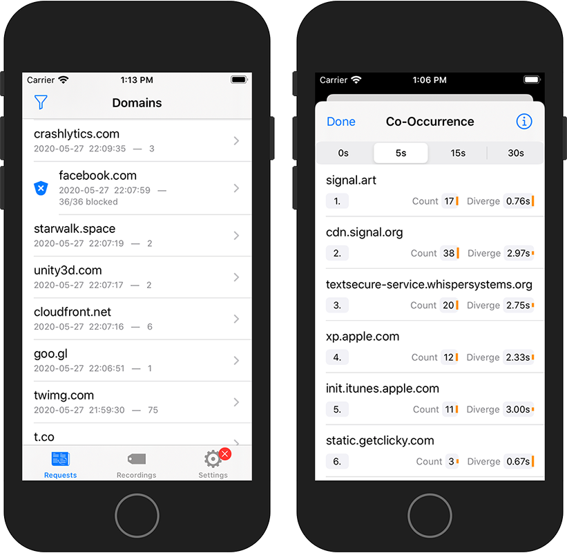

AppCheck – Privacy Monitor
==========================

A pocket DNS monitor and network filter.

## What is it?

AppCheck helps you identify applications that communicate with other parties.

Join the [Testflight beta][testflight] or look at the evaluation results [appchk.de].

### How does it work?

AppCheck creates a local VPN proxy to intercept all network connections.
For each connection, AppCheck looks into the DNS headers only, namely the domain names.
These domain names are logged in the background while the VPN is running.
AppCheck does not need to be active all the time.

### What about privacy?

Your data belongs to you.
Therefore, monitoring takes place on your device only.
AppCheck learns only the destination addresses, not the actual data that is exchanged.
The app does not share any data with us or any other third-party – unless you choose to.

### How can I contribute?

AppCheck allows you to record app-specific activity.
You can share these recordings with the community; it can help you and others avoid phony applications, even before you install an app.

Join the [Testflight beta][testflight]

## Features

- See outgoing (DNS) network requests in real-time
- See the history of previous connections
- Block unwanted traffic based on domain names
- Record app-specific activity1
- Apply logging filters (block or ignore) and display filters (specific range or last x minutes)
- Sort results by time, name, or occurrence count
- Context Analysis
  - What other domains often occur at the same time?
  - What happened immediately before or after the action?
- Export results for custom analysis
- Alert Monitor & reminder
- Participate in privacy research
	- Contribute your results
	- See what others have unveiled
	- How much traffic does this app produce?

1 Due to technical limitations, recordings can not be restricted to a single application. Remember to force-quit all other applications before starting a recording.

## Research Project

This research project is an effort to shine a light on the background activity of iOS apps, making the otherwise hidden network connections visible to everyone.
The goal is to make privacy more accessible to the general public.
And thus create incentives for app developers to respect users' privacy.

We want to offer users, activists, data protection authorities, and data protection officers an easily accessible and flexible tool to assess the privacy measures of iOS applications.
AppCheck allows users to:

- get a visual overview of an apps communication signature
- assess how an app ranks within its peer group or category
- influence the ranking according to their preferences

The evaluation results page is at [appchk.de].

[testflight]: https://testflight.apple.com/join/9jjaFeHO
[appchk.de]: https://appchk.de/
