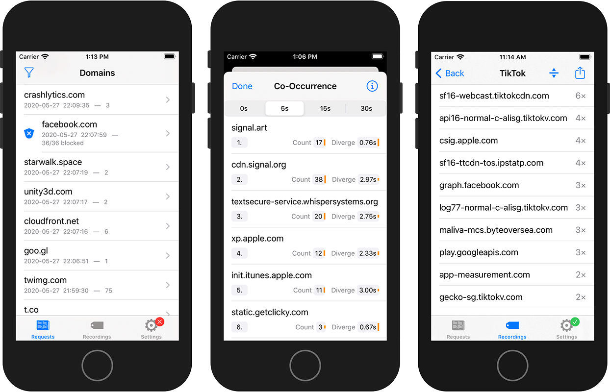

AppCheck – Privacy Monitor
==========================

A pocket DNS monitor and network filter.

## What is it?

AppCheck helps you identify which applications communicate with third parties.
It does so by logging network requests.
AppCheck learns only the destination addresses, not the actual data that is exchanged.

Your data belongs to you.
Therefore, monitoring and analysis take place on your device only.
The app does not share any data with us or any other third-party – unless you choose to.

Join [Testflight beta](https://testflight.apple.com/join/9jjaFeHO)

### How does it work?

AppCheck creates a local VPN tunnel to intercept all network connections.
For each connection AppCheck looks into the DNS headers only, namely the domain names.
These domain names are logged in the background while the VPN is active.
That means, AppCheck does not have to be active in the foreground all the time.

## Features

- See outgoing (DNS) network requests in real-time
- See history of previous connections
- Block unwanted traffic based on domain names
- Record app specific activity1
- Apply logging filters (block or ignore) and display filters (specific range or last x minutes)
- Sort results by time, name, or occurrence count
- Context Analysis
  - What other domains occur often at the same time?
  - What happened immediately before or after the action?
- Export results for custom analysis
- Alert Monitor & reminder
- Participate in privacy research
	- Contribute your results
	- See what others have unveiled
	- How much traffic does this app produce?

1 Due to technical limitations, recordings can not be restricted to a single application. Remember to force-quit all other applications before starting a recording.

## Research Project

*information will be added soon™*

